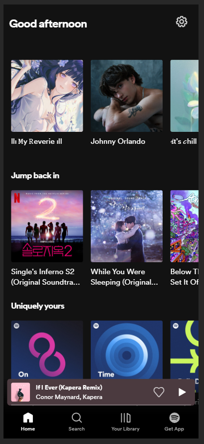

# Procesverslag
Markdown is een simpele manier om HTML te schrijven.  
Markdown cheat cheet: [Hulp bij het schrijven van Markdown](https://github.com/adam-p/markdown-here/wiki/Markdown-Cheatsheet).

Nb. De standaardstructuur en de spartaanse opmaak van de README.md zijn helemaal prima. Het gaat om de inhoud van je procesverslag. Besteedt de tijd voor pracht en praal aan je website.

Nb. Door *open* toe te voegen aan een *details* element kun je deze standaard open zetten. Fijn om dat steeds voor de relevante stuk(ken) te doen.

## Jij

  
uitwerken voor kick-off werkgroep

  ### Auteur:
  Kenza Bennani-Meziane
  #### Je startniveau:
  Rode piste

  #### Je focus:
  Surface Plane

## Je website

  
uitwerken voor kick-off werkgroep

  ### Je opdracht:
  https://open.spotify.com/

  #### Screenshot(s) van de eerste pagina (small screen): 
  Home pagina  
  

  #### Screenshot(s) van de tweede pagina (small screen):
  Playlist pagina 
  
 

## Toegankelijkheidstest 1/2 (week 1)

  
uitwerken na test in 2e werkgroep

  ### Bevindingen
  Lijst met je bevindingen die in de test naar voren kwamen:

Content
  - Afspeellijsten zoals de daily mix zeggen niet veel als je alleen de naam hoort. (Er wordt gezegd waar de link naartoe lijd)

Global Code
  - maximum-scale is minder dan 3 

Keyboard
  - Je begint met de side bars.

Headings
  - Ze gebruiken op veel plekken geen H1, H2, H3.. of p voor tekst elementen maar div's.

Lists
  - Maakt geen gebruik van list items

Images
  - Nergens een alt atribuut

Controls
  - Er zijn veel elementen waar je op kunt klikken, maar het is meer als app gedesigned dan als website.

Appearance
  - Spotify is standaard ingesteld in Dark Mode

## Breakdownschets (week 1)

  
uitwerken na afloop 3e werkgroep

  ### de hele pagina: 
  

  ### dynamisch deel (bijv menu): 
  

  ### wellicht nog een dynamisch deel (bijv filter): 
  

## Voortgang 1 (week 2)

  
uitwerken voor 1e voortgang

  ### Stand van zaken
  hier dit ging goed & dit was lastig (neem ook screenshots op van delen van je website en code)

  Het beginnen was een beetje lastig, ik wist niet zo goed hoe ik een opzet moest maken.
  Met behulp van de leraar en het advies dat ik kreeg, kon ik makkelijk op weg en besloot ik per deel alles goed uit te werken voordat ik naar het volgende deel besloot te gaan.

  ### Agenda voor meeting
  samen met je groepje opstellen

  | Kenza          | Bregtje            | Fleur        | Stella           |
  | ---            | ---                | ---          | ---              |
  | Stappenplan    | HTML Checken       | JavaScript   | Uploaden Github  |
  | bespreken      | Hover werkt niet   |              | HTML/CSS checken |
  |                | Webkit scrollbar   |              | Flexbox          |

  ### Verslag van meeting
  hier na afloop snel de uitkomsten van de meeting vastleggen

  - punt 1
  - punt 2
  - nog een punt
  - ...

## Voortgang 2 (week 3)

  
uitwerken voor 2e voortgang

  ### Stand van zaken
  hier dit ging goed & dit was lastig (neem ook screenshots op van delen van je website en code)

  ### Agenda voor meeting
  samen met je groepje opstellen

  | Kenza          | Bregtje            | Fleur        | Sanne            |
  | ---            | ---                | ---          | ---              |
  | dit bespreken  | en dit             | en ik dit    | en dan ik dat    |
  | en dat ook nog | dit als er tijd is | nog een punt | dit wil ik zeker |
  | ...            | ...                | ...          | ...              |

  ### Verslag van meeting
  hier na afloop snel de uitkomsten van de meeting vastleggen

  - punt 1
  - punt 2
  - nog een punt
- ...

## Toegankelijkheidstest 2/2 (week 4)

  
uitwerken na test in 9e werkgroep

  ### Bevindingen
  Lijst met je bevindingen die in de test naar voren kwamen (geef ook aan wat er verbeterd is):
  
  Content
  - 

## Voortgang 3 (week 4)

  
uitwerken voor 3e voortgang

  ### Stand van zaken
  hier dit ging goed & dit was lastig (neem ook screenshots op van delen van je website en code)

  ### Agenda voor meeting
  samen met je groepje opstellen

  | Kenza          | Bregtje            | Fleur        | Sara             |
  | ---            | ---                | ---          | ---              |
  | dit bespreken  | en dit             | en ik dit    | en dan ik dat    |
  | en dat ook nog | dit als er tijd is | nog een punt | dit wil ik zeker |
  | ...            | ...                | ...          | ...              |

  ### Verslag van meeting
  hier na afloop snel de uitkomsten van de meeting vastleggen

  - punt 1
  - punt 2
  - nog een punt
  - ...

## Eindgesprek (week 5)

  
uitwerken voor eindgesprek

  ### Je uitkomst - karakteristiek screenshots:
  

  ### Dit ging goed/Heb ik geleerd: 
  Korte omschrijving met plaatjes

  

  ### Dit was lastig/Is niet gelukt:
  Korte omschrijving met plaatjes

  

## Voortgang 4 (week 6)

  
uitwerken voor 4e voortgang

  ### Stand van zaken
  Uit mijn eindgesprek heb ik feedback gekregen en dit verwerkt. 

  ### Verslag van meeting
  hier na afloop snel de uitkomsten van de meeting vastleggen

  - punt 1
  - punt 2
  - nog een punt
  - ...

## Bronnenlijst

  
continu bijhouden terwijl je werkt

  Nb. Wees specifiek ('css-tricks' als bron is bijv. niet specifiek genoeg). 
  Nb. ChatGpT en andere AI horen er ook bij.
  Nb. Vermeld de bronnen ook in je code.

  1. ChatGPT (voor het verbergen van de scrollbar op Profile pagina)
  2. States oefening van de les (voor de underline in "Show All" linkjes)
  3. ...

